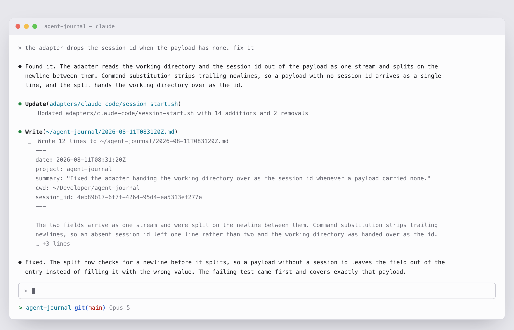

<div align='center'>
  <h1>Agent Journal</h1>
  <p align="center">A journal written by your agent. Autonomously.</p>

  <picture>
    <source media="(prefers-color-scheme: dark)" srcset="assets/session-dark.png" />
    <source media="(prefers-color-scheme: light)" srcset="assets/session-light.png" />
    
  </picture>
</div>

## Why

Working with agents is fast-paced: you work on multiple projects in parallel, make decisions on every turn, generate ideas and build new things.
Your agents do the work, then disappear. A week later you cannot answer simple questions:

- What did we do last week?
- Why did we build it this way?
- What did we try that did not work?

Agent Journal makes the model record its work along the way: one small markdown file per milestone, written on its own, in a format that's easy to read and scan. A year later, the answer is one question to your agent, or one `grep`, away.

## Privacy-first

Nothing leaves your machine.

- **No server, no account, no API requests.** The plugin runs locally. It makes no network requests.
- **No hidden tool calls.** Entries are written by the model's own file-writing tool, in your session, in front of you. Nothing runs in the background and nothing runs between sessions.
- **Your own files.** Entries are plain markdown in a directory you choose. Delete one and it is gone.

Everything stays between you and your model.

## How

At the start of a session, the plugin injects [`INSTRUCTIONS.md`](INSTRUCTIONS.md) into the context. It contains the journalling rules and the resolved values for your current project, working directory and session.

The model then records important events in a new markdown file inside `~/agent-journal/`. It does so on its own, without being asked and without interrupting you.

## Format

Each journal entry is a new markdown file. The filename is the current UTC timestamp in `YYYY-MM-DDTHHMMSSZ` format:

```
~/agent-journal/2026-01-11T143000Z.md
```

The file starts with frontmatter metadata, for a quick search across many files. The body contains the actual event:

```markdown
---
date: 2026-01-11T14:30:00Z
project: my-awesome-lib
summary: "Shipped the v1.2 sync path on prepared statements, with rollback when a batch fails."
cwd: ~/Developer/my-awesome-lib
session_id: 4eb89b17-6f7f-4264-95d4-ea5313ef277e
---

Replaced the string-interpolated SQL in the sync path with prepare(). Added a rollback so a
failed batch leaves nothing half-written, which is what caused Thursday's partial state.
```

## Recall

Filenames are UTC timestamps, so a glob is a date range and `ls` is already chronological:

```sh
# the most recent entries
ls ~/agent-journal | tail -5

# how many entries this year
ls ~/agent-journal/2026-*.md | wc -l

# one dated line per entry, for a day or a month
grep -h '^summary:' ~/agent-journal/2026-01-11*.md

# every entry for one project
grep -rl '^project: foo$' ~/agent-journal

# anywhere in an entry, body included
grep -rl 'rate limit' ~/agent-journal | tail -3

# one entry in full
cat ~/agent-journal/2026-01-11T143000Z.md
```

The agent can recall entries on its own, just ask "What did we work on last week?" to try it.

## Install

### Claude Code 

Install the plugin:

```
/plugin marketplace add zirkelc/agent-plugins
/plugin install agent-journal@zirkelc
```

Then open a new session and ask Claude to write a journal entry.
By default, it will write to the directory `~/agent-journal/`.

Run `/agent-journal:config` in Claude to change the directory.

#### Permissions

Depending on your permission mode, Claude will ask for permission to write a journal entry. To allow journal entries in general, add this to `~/.claude/settings.json`:

```json
{
  "permissions": {
    "allow": ["Edit(~/agent-journal/**)"]
  }
}
```

### Manual Installation

Run this command and follow the instructions:

```sh
curl -fsSL https://raw.githubusercontent.com/zirkelc/agent-journal/main/install.sh | sh
```

It will detect your agents and provide specific instructions. It also symlinks the `agent-journal` CLI and the shorter `aj` into `~/.local/bin` and makes them accessible from `$PATH`.

### Command line

> [!NOTE] 
> You need to run the [manual installation](#manual-installation) to make the CLI available.

The CLI is optional and only required if you want to interact with `agent-journal` manually from your shell. 
It provides a thin interface over `ls` and `grep` for common commands:

| command | same as | description |
| --- | --- | --- |
| `aj list` | `ls ~/agent-journal \| tail -20` | the most recent entries, one line each |
| `aj search TEXT` | `grep -rli 'rate limit' ~/agent-journal` | summaries and bodies, ignoring case |
| `aj read ID` | `cat "$(ls ~/agent-journal/*.md \| tail -1)"` | one entry in full |
| `aj write` | `$EDITOR ~/agent-journal/$(date -u +%Y-%m-%dT%H%M%SZ).md` | add an entry yourself |
| `aj config` | `cat ~/.config/agent-journal/config` | read and change the settings |
| `aj context` | | the instruction an adapter injects at session start |
| `aj help` | | every command and option |

`list` is the default command if not given, so `aj` and `aj list` are the same. 

Entries are listed oldest first, so the newest is nearest the prompt.

`list` and `search` take the same filters:

| filter | value | description |
| --- | --- | --- |
| `--date` | `2026`, `2026-01`, `2026-01-11`, `2026-01-11T143000Z` | a prefix of the timestamp, at any granularity |
| `--since` | `2026-01-11`, `today`, `7d` | from this day on |
| `--until` | same forms | up to this day |
| `--project` | a project name | entries filed under one project, across all its worktrees |
| `--cwd` | a directory, or `.` for here | one directory and everything under it |
| `--limit` | a number, default `20` | how many of the most recent to print |
| `--all` | | no limit |

Run `aj help` for the usage help.

### Other agents

Not yet. Codex is next, and adding one is a directory with a small script in it:
see [`adapters/README.md`](adapters/README.md).

## Configuration

The default directory for journal entries is `~/agent-journal`.

The config lives in `~/.config/agent-journal/config` as flat `key=value` pairs:

```
# agent-journal config

# journal_dir=<directory>
journal_dir=~/agent-journal
```

Run `/agent-journal:config` in your agent to change it or update the config manually.

## Credits

The idea for an agent journal is inspired by [Malaiac's Claude Diary](https://github.com/Malaiac/claude/tree/main/templates/diary).

## License

MIT
