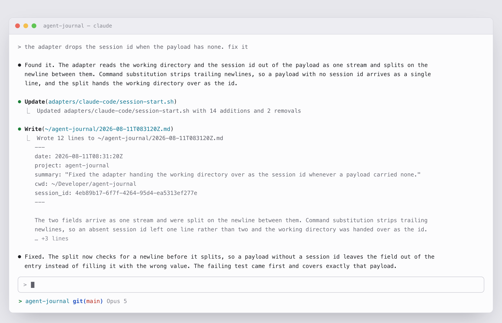

<div align='center'>
  <h1>Agent Journal</h1>
  <p align="center">A journal written by your agent. Autonomously.</p>

  <picture>
    <source media="(prefers-color-scheme: dark)" srcset="assets/session-dark.png" />
    <source media="(prefers-color-scheme: light)" srcset="assets/session-light.png" />
    
  </picture>
</div>

## Why

Working with agents is fast-paced: you work on multiple projects in parallel, make decisions on every turn, generate ideas and build new things.
Your agents do the work, then disappear. A week later you cannot answer simple questions:

- What did we do last week?
- Why did we build it this way?
- What did we try that did not work?

Agent Journal makes the model record its work along the way: one small markdown file per milestone, written on its own, in a format that's easy to read and scan. A year later, the answer is one question to your agent, or one `grep`, away.

## Privacy-first

Nothing leaves your machine.

- **No server, no account, no API requests.** The plugin runs locally and makes no network requests of its own.
- **No hidden tool calls.** Entries are written by the model's own file-writing tool, in your session, in front of you.
- **A read-only hook.** At session start, a hook reads the config and resolves the dynamic values (project, agent, session, etc.).
- **Your own files.** Entries are plain markdown in a directory you choose. Delete one and it is gone.

Everything stays between you and your model.

## How

At the start of a session, the plugin injects [`INSTRUCTIONS.md`](templates/INSTRUCTIONS.md) into the context. It contains the journalling rules and the resolved values for your current project, working directory, agent and session.

The model then records each important event in a new markdown file in `~/agent-journal/`. It does this without being asked and without interrupting you.

## Format

Each journal entry is a new markdown file. The filename is the current UTC timestamp in `YYYY-MM-DDTHHMMSSZ` format:

```
~/agent-journal/2026-01-11T143000Z.md
```

The file starts with frontmatter, so a search across many files can match single fields. The body describes what happened:

```markdown
---
date: 2026-01-11T14:30:00Z
project: my-awesome-lib
summary: "Shipped the v1.2 sync path on prepared statements, with rollback when a batch fails."
cwd: ~/Developer/my-awesome-lib
host: "macbook"
user: "chris"
agent: claude/opus-5
session_id: 4eb89b17-6f7f-4264-95d4-ea5313ef277e
---

Replaced the string-interpolated SQL in the sync path with prepare(). Added a rollback so a failed batch leaves nothing half-written, which is what caused Thursday's partial state.
```

## Recall

Filenames are UTC timestamps, so a glob is a range of UTC dates and `ls` is already chronological:

```sh
# the most recent entries
ls ~/agent-journal | tail -5

# how many entries this year
ls ~/agent-journal/2026-*.md | wc -l

# one dated line per entry, for a day or a month
grep -h '^summary:' ~/agent-journal/2026-01-11*.md

# every entry for one project
grep -rl '^project: foo$' ~/agent-journal

# anywhere in an entry, body included
grep -rl 'rate limit' ~/agent-journal | tail -3

# one entry in full
cat ~/agent-journal/2026-01-11T143000Z.md
```

The agent can also recall entries on its own. To try it, ask "What did we work on last week?".

## Install

### Shell

Run this command:

```sh
curl -fsSL https://raw.githubusercontent.com/zirkelc/agent-journal/main/install.sh | sh
```

It finds the agents installed on this machine and prints the steps for each one. It also symlinks the `agent-journal` CLI into `~/.local/bin`. If that directory is not on your `$PATH`, it prints the line to add to your shell profile.

### Claude

The plugin needs Claude Code 2.1.287 or later, because it is a [mod](https://code.claude.com/docs/en/plugins/mods/overview), a hooks module that Claude Code loads itself. Install the plugin:

```
/plugin marketplace add zirkelc/agent-plugins
/plugin install agent-journal@zirkelc
```

Then open a new session and ask Claude to write a journal entry. By default, it writes to the directory `~/agent-journal/`.

#### Update

Get the latest marketplace catalog, then update the plugin:

```sh
claude plugin marketplace update zirkelc
claude plugin update agent-journal@zirkelc
```

Then restart Claude Code or run `/reload-plugins` to load the new version.

#### Permissions

Depending on your permission mode, Claude asks for permission to write a journal entry. To allow all journal entries, add this to `~/.claude/settings.json`:

```json
{
  "permissions": {
    "allow": ["Edit(~/agent-journal/**)"]
  }
}
```

If you changed `journal_dir`, use that directory in the rule.

For the journal pane, how the hooks give the rules to the session, and what the plugin runs, reads and sends, see the [Claude Code plugin README](claude-code/README.md).

### Codex

Install the plugin:

```
codex plugin marketplace add zirkelc/agent-journal
codex plugin add agent-journal@zirkelc
```

Codex reviews a hook before it runs it, so one step is left. Start Codex, run `/hooks`, and trust `agent-journal`. Until you do, Codex skips the hook and shows no message.

Then open a new session and ask Codex to write a journal entry. By default, it writes to the directory `~/agent-journal/`.

#### Permissions

Codex grants write access by path rather than by tool, so the journal directory has to be a writable root. Add to `~/.codex/config.toml`:

```toml
sandbox_mode = "workspace-write"

[sandbox_workspace_write]
writable_roots = ["/Users/you/agent-journal"]
```

Use the full path rather than `~`. `writable_roots` only applies in `workspace-write` mode; in `read-only` every entry stops to ask, and in `danger-full-access` nothing is restricted and this is unnecessary.

### CLI

> [!NOTE]
> You need to run the [shell installation](#shell) to make the CLI available.

The CLI is optional. You need it only to work with the journal from your shell. It is a thin layer over `ls` and `grep` for common commands:

| command | same as | description |
| --- | --- | --- |
| `aj list` | `ls ~/agent-journal \| tail -20` | the most recent entries, one line each |
| `aj search TEXT` | `grep -rli 'rate limit' ~/agent-journal` | summaries and bodies, ignoring case |
| `aj read ID` | `cat "$(ls ~/agent-journal/*.md \| tail -1)"` | one entry in full |
| `aj write` | `$EDITOR ~/agent-journal/$(date -u +%Y-%m-%dT%H%M%SZ).md` | add an entry yourself |
| `aj config` | `cat ~/.config/agent-journal/config` | read and change the settings |
| `aj sync` | `git add -A && git commit && git push` | commit the journal folder and push it, see [Git sync](#git-sync) |
| `aj install` | | which agents are on this machine, and how to wire each one up |
| `aj help` | | every command and option |

`list` is the default command, so `aj` and `aj list` are the same.

Entries are listed oldest first, so the newest is nearest the prompt. Each line starts with the entry ID, which `aj read` takes as it is. In a terminal the columns are aligned. Down a pipe they are separated by one tab each (ID, project, summary), so `aj list | cut -f1` gives the IDs, and an entry with no project has an empty field.

`list` and `search` take the same filters:

| filter | value | description |
| --- | --- | --- |
| `--date` | `2026`, `2026-01`, `2026-01-11` | one year, month or day |
| `--since` | `2026-01-11`, `today`, `7d`, `2026-01-11T14:30:00+01:00` | from this day or time on |
| `--until` | same forms | up to and including this day or time |
| `--project` | a project name, or `.` for here | entries filed under one project, across all its worktrees. `.` names the repository of the current directory the same way the session-start hook does, and fails outside a repository |
| `--cwd` | a directory, or `.` for here | one directory and everything under it |
| `--limit` | a number, default `20` | how many of the most recent to print |
| `--offset` | a number, default `0` | skip this many of the most recent first, to page back through older entries |
| `--all` | | no limit |

Days are local days, in the time zone of the machine. The IDs stay UTC, so an entry written just after local midnight can carry the date before: in Berlin in winter, `--date 2026-01-11` includes `2026-01-10T231500Z`. A time takes an offset (`+01:00`) or `Z`, and without one it is local time. `--until` with a time includes an entry written in that second. For one exact entry, use `aj read` with its ID.

`aj write` also takes `--project .`. There it names the repository of `--cwd`, the directory the entry records, and also fails outside a repository.

`aj install` with no agent named lists the ones found on this machine, with the command to wire up each. Naming one (`aj install codex`) runs that agent's own plugin commands for you. It writes nothing into any agent's configuration.

Run `aj help` for the usage help.

## Configuration

The config lives in `~/.config/agent-journal/config` and you can edit the file directly:

```
# agent-journal config

# journal_dir=<directory>
journal_dir=~/agent-journal
```

If you have the [CLI](#cli) installed, you can change the config with `agent-journal config set <key> <value>`:

| key | default | description |
| --- | --- | --- |
| `journal_dir` | `~/agent-journal` | default directory for journal entries |
| `sync` | off | `git` to commit and push the journal folder after each write, see [Git sync](#git-sync) |
| `host` | the local host name on macOS, else the host name without its domain | the machine name each entry records. Set it to `''` to record none |
| `user` | the login name | the account name each entry records. Set it to `''` to record none |

With git sync, one journal can hold entries from several machines. `host` and `user` tell you where an entry was written, and so where you can resume its session. Set a stable name if the system's name changes or tells more than you want to share, for example `aj config set host macbook`. `aj config unset host` gives the system's name back.

## Git sync

agent-journal can keep the journal in a git repository. It commits each new entry, and it pushes when the branch has a remote. Sync is off by default. To turn it on:

```sh
aj sync init                                  # commit only, on this machine
aj sync init git@github.com:you/journal.git   # commit and push
```

`aj sync init` makes the journal folder a git repository if it is not one yet, adds the URL as `origin`, sets `sync=git`, and makes the first commit. If the folder is already a repository, it uses it. The journal folder must be the root of its own repository. `aj sync init` refuses a folder inside a larger repository (for example your notes or your dotfiles), because a push sends the whole branch, with your other commits too. To turn sync off, run `aj config unset sync`.

To make a new private repository on GitHub for the journal, use the [GitHub CLI](https://cli.github.com) after `aj sync init`. It adds the repository as `origin` and pushes the first commit, and every later sync pushes to it:

```sh
aj sync init
gh repo create agent-journal --private --source ~/agent-journal --remote origin --push
```

Use your own journal folder in `--source` if you changed `journal_dir`.

When sync is on, `aj sync` runs:

- in Claude Code, after each entry and when the session ends ([more](claude-code/README.md#git-sync)).
- after `aj write`.
- when you run `aj sync` yourself, for example for entries that Codex wrote.

Each sync commits every file in the journal folder. The commit names a single new entry by its ID and summary. Then it pushes the current branch. If the remote has commits that this machine does not have (another machine pushed first, or you created the repository with a README), it rebases onto them and pushes again; entries have unique file names, so this does not conflict. If the push fails (no network, no credentials), the commit stays, and the next sync pushes it. A sync commits nothing on a detached HEAD or while a merge, rebase or bisect is open.

A sync never waits for input: git does not prompt for a password, ssh runs in batch mode (also with your own `core.sshCommand`), and the journal's commits are not signed, so no passphrase dialog opens.

> [!WARNING]
> A push sends your entries to the remote. Entries describe your work, so use a private repository.

## Development

Each plugin is a folder of its own: [`claude-code/`](claude-code) for Claude Code and [`codex/`](codex) for Codex. An install copies only the plugin folder, not the rest of this repository. So each plugin folder holds a copy of the shared core: `templates/`, `LICENSE`, and `bin/agent-journal` as `scripts/agent-journal`. A plugin has no `bin/` folder, because Claude Code puts that folder on the Bash tool's `PATH`, and claude.ai and Cowork do not install a plugin that has one. `lib/` holds the `install` command, which runs only from the CLI install, so the plugins do not need it.

Edit the shared core at the repository root, never the copies. The pre-commit hook copies the staged root files into each plugin folder and stages the copies. `pnpm install` turns the hook on. To copy without a commit, stage the root files and run `pnpm sync`. The tests fail when a copy is not equal to its root file.

## Credits

The idea for an agent journal comes from [Malaiac's Claude Diary](https://github.com/Malaiac/claude/tree/main/templates/diary).

## License

MIT
